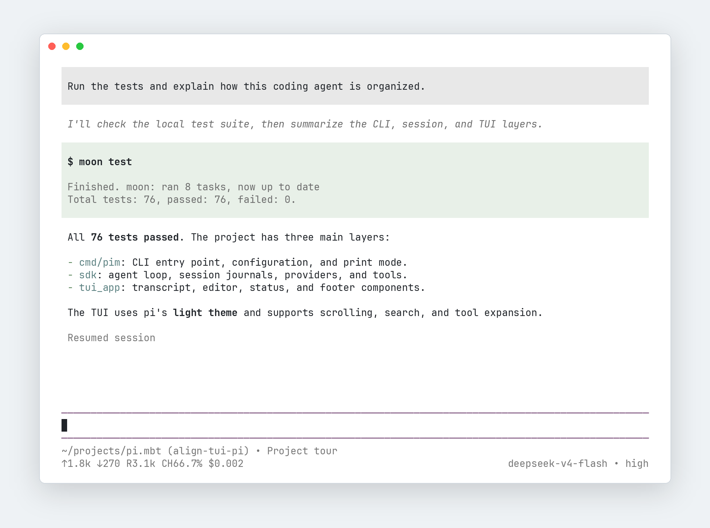

# pi.mbt

[](https://coveralls.io/github/kkkiio/pi.mbt?branch=main)

用 MoonBit 重新实现的 [pi](https://github.com/earendil-works/pi) coding agent 子集。



## Install

```bash
just package          # 构建 npm dist
npm install -g .      # symlink 到全局
```

## Usage

在终端中直接运行 `pim` 进入全屏 TUI:

```bash
pim
```

`Ctrl+O` 展开工具输出,`Ctrl+T` 切换思考显示,`Esc` 中断当前回合。

`-p/--print` 单轮、非交互模式:

```bash
DEEPSEEK_API_KEY=sk-xxx
pim -p "What's the capital of France? Respond with only the city name."
# Paris
```

加上 `--mode json` 可以输出 JSONL 事件流:

```bash
pim -p "What's the capital of France? Respond with only the city name." --mode json
# {"type":"agent_start"}
# {"type":"turn_start"}
# {"type":"message_start","message":{"role":"user","content":[{"type":"text","text":"What's the capital of France? Respond with only the city name."}],"timestamp":1786903823973}}
# ...
# {"type":"agent_end"}
```

## Configuration

| 变量              | 作用                                                 |
| ----------------- | ---------------------------------------------------- |
| `PIM_CONFIG_DIR`  | 配置目录,默认 `~/.pim`                               |
| `PIM_SESSION_DIR` | 会话 JSONL 目录(等价于 `--session-dir`) |

会话默认落盘:不设 `PIM_SESSION_DIR`/`--session-dir` 时,提示词与工具输出会
持久化到 `~/.pim/sessions/` 下(同时创建会话目录)。不想落盘(如敏感内容、
一次性调试)请传 `--no-session`。多轮会话用 `--continue`(接着最近一次)或
`--resume <前缀>`。

### 认证配置

认证优先使用文件配置 `~/.pim/auth.json`:

```json
{
  "deepseek": { "type": "api_key", "key": "sk-xxx" }
}
```

也支持环境变量:

```bash
DEEPSEEK_API_KEY=sk-xxx pim -p "hi"
```
